# **Train Ticket Reservation System**

### **Overview**

The **Train Ticket Reservation System** is a cutting-edge web application designed to transform the train booking experience. This sophisticated system provides users with a comprehensive platform for managing train travel efficiently and effortlessly. Whether you're looking to check schedules, book tickets, or manage reservations, this system offers a seamless experience with its intuitive interface and robust functionalities.

This project showcases a modern approach to web application development, emphasizing user-centric design, security, and scalability. It integrates advanced technologies to ensure that both users and administrators have a powerful tool for handling train travel needs.

### **Features and Functionality**

#### **Key Features**
- **View Train Schedules:** Browse detailed schedules including departure and arrival times, routes, and stopovers.
- **Search Trains:** Utilize advanced search filters by date, time, and destination to find the most suitable trains.
- **Seat Availability:** Check real-time seat availability to make informed booking decisions.
- **Train Timings:** Get accurate and up-to-date train timings with notifications on delays and cancellations.
- **Fare Inquiry:** Access fare details for various trains, routes, and classes for budget-friendly planning.
- **Trains Between Stations:** Discover trains running between specific stations, including intermediate stops and travel durations.
- **Online Booking:** Enjoy a secure and user-friendly online booking process with real-time seat reservations and instant confirmations.
- **Login and Logout Security:** Robust security measures to safeguard user personal and payment information.
- **Password Management:** Easy and secure password change options to maintain account integrity.
- **Payment Gateway Integration:** Support for multiple payment methods through a secure payment gateway.
- **Booking History:** Review and manage your past bookings for convenient travel planning.

#### **Admin Features**
- **Login:** Secure access to the admin panel for system management.
- **Add Trains:** Efficiently add new trains with comprehensive route, schedule, and fare details.
- **Update Trains:** Modify existing train information to keep the system current.
- **Remove/Cancel Trains:** Manage cancellations and remove trains as needed.
- **View Trains:** Full visibility into all trains listed in the system.
- **Profile Management:** Update administrator profile information for enhanced management.
- **Logout:** Safe and secure logout functionality to ensure data protection.

#### **User Features**
- **Register:** Simple and secure user registration process.
- **Login:** Protect user accounts with secure login capabilities.
- **View Trains:** Access detailed schedules and train information easily.
- **Check Seat Availability:** Real-time seat availability for hassle-free booking.
- **Search Trains:** Advanced search options to find the best trains based on user preferences.
- **Train Availability and Fare Inquiry:** Comprehensive information on availability and fares.
- **Book Tickets:** Seamless booking process with instant confirmation and e-tickets.
- **View Booking History:** Access past bookings to manage travel plans.
- **Update Profile:** Manage and update user profile details.
- **Change Password:** Secure and straightforward password management.
- **Logout:** Safe logout process to protect user information.

### **Technologies Utilized**

#### **Front-End Development**
- **HTML:** Provides the structural foundation for all pages, ensuring they are well-organized and accessible.
- **CSS:** Enhances the visual appeal of the application with a cohesive and attractive design.
- **Bootstrap:** Ensures a responsive design that adapts seamlessly to different screen sizes and devices.

#### **Back-End Development**
- **Java (J2EE):** Powers the server-side logic, offering high performance and reliability for handling user requests.
- **JDBC:** Facilitates smooth integration with the Oracle database for data management.
- **Servlet:** Manages user interactions by handling request and response processes.
- **Oracle (SQL):** Provides a robust and secure database platform for storing and retrieving data.

### **Software and Tools**
- **Git:** Version control system to track code changes and collaborate effectively.
- **Java JDK 8+:** Development tools for building and running Java applications.
- **Eclipse EE:** Integrated development environment (IDE) for efficient coding and debugging.
- **Apache Maven:** Build automation and project management tool to streamline development processes.
- **Tomcat v8.0+:** Web server to host the application and ensure reliable runtime performance.
- **Oracle (SQL) / SQL PLUS:** Tools for managing and querying the Oracle database.
- **Oracle SQL Developer:** Database management tool for designing and handling database operations.

### **Screenshots**

Explore the various features of the Train Ticket Reservation System through the following screenshots:

1. **Homepage**
   
   - The central hub where users can navigate to all major functionalities of the system.

2. **Train Search**
   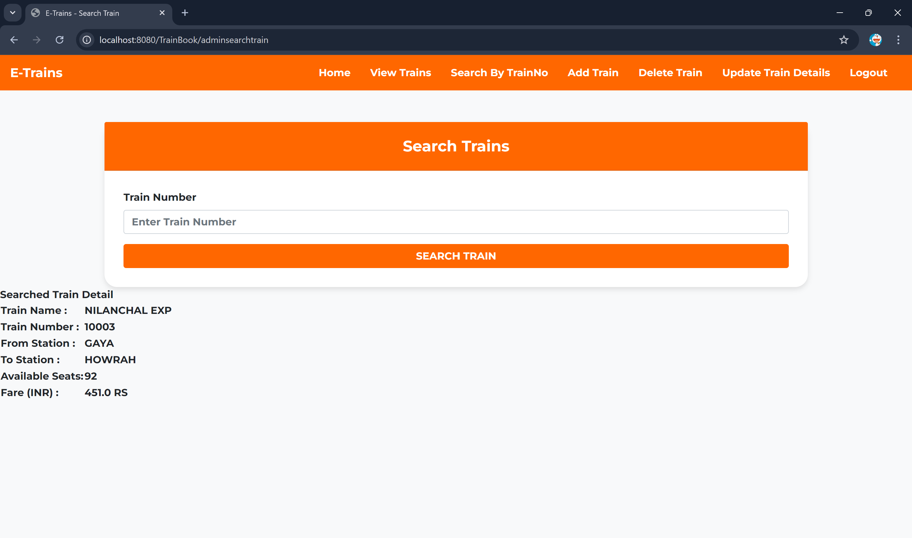
   - Interface for searching available trains based on user-specified criteria.

3. **Seat Availability**
   
   - Real-time seat availability display for selected trains.

4. **Admin Login**
   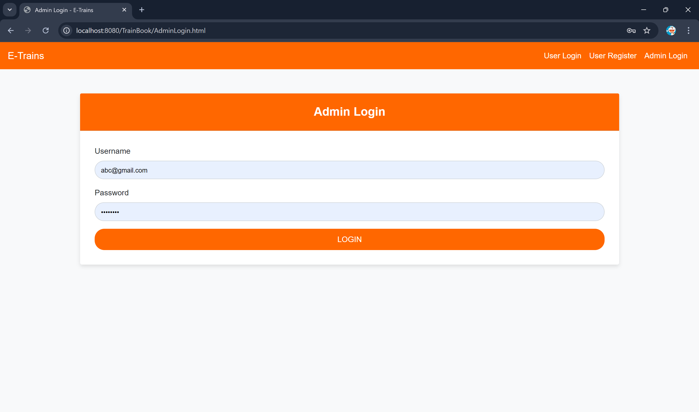
   - Secure login page for administrators to access the admin panel.

5. **Payment Gateway**
   
   - Secure payment interface for completing transactions.

6. **Book Trains**
   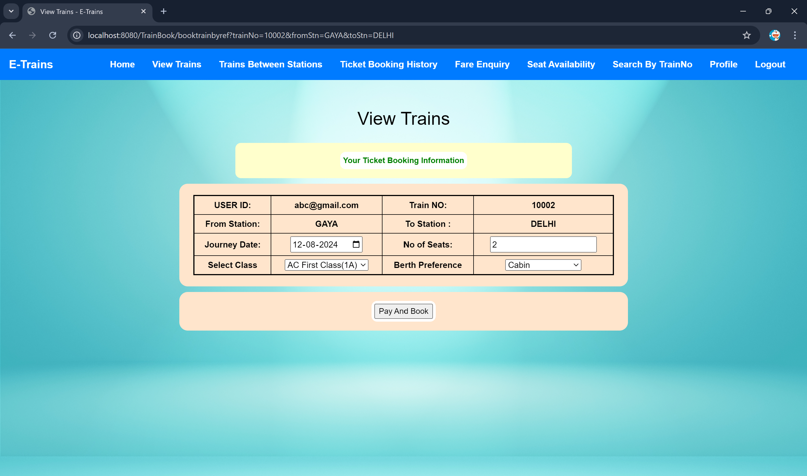
   - Booking page where users can select and reserve train seats.

7. **User Registration**
   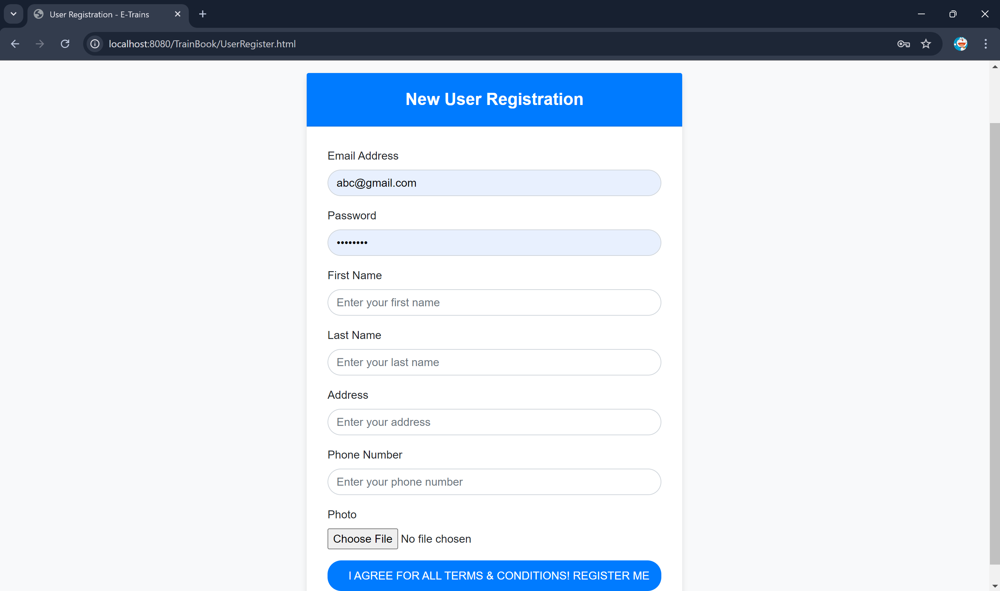
   - Registration form for new users to create their accounts.

8. **Booking History**
   
   - Page displaying a user’s past booking records.

9. **User Profile**
   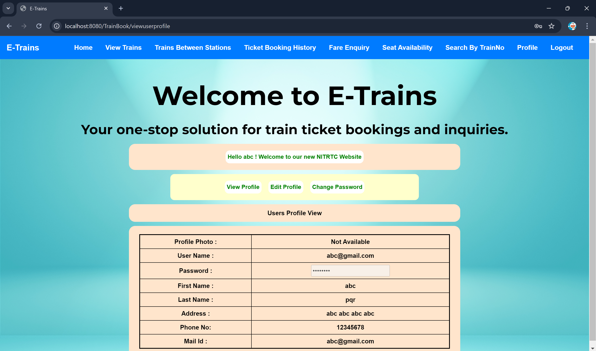
   - User profile page for managing personal information.

10. **Admin Add Train**
    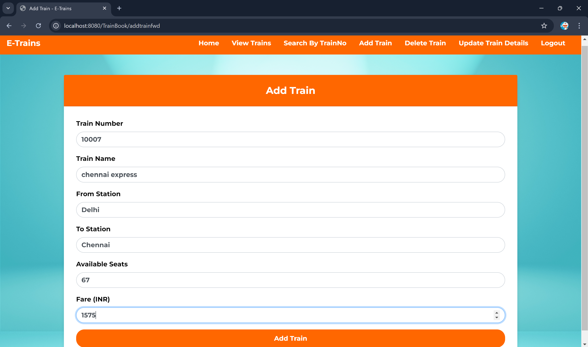
    - Admin interface for adding new train details.

11. **Admin Update Train**
    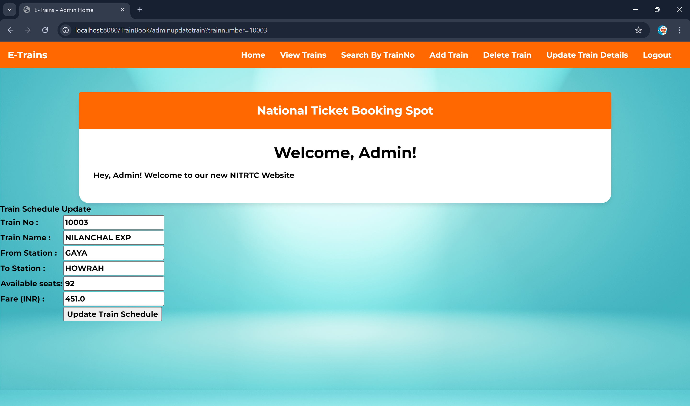
    - Admin interface for updating existing train information.

12. **Admin Cancel Train**
    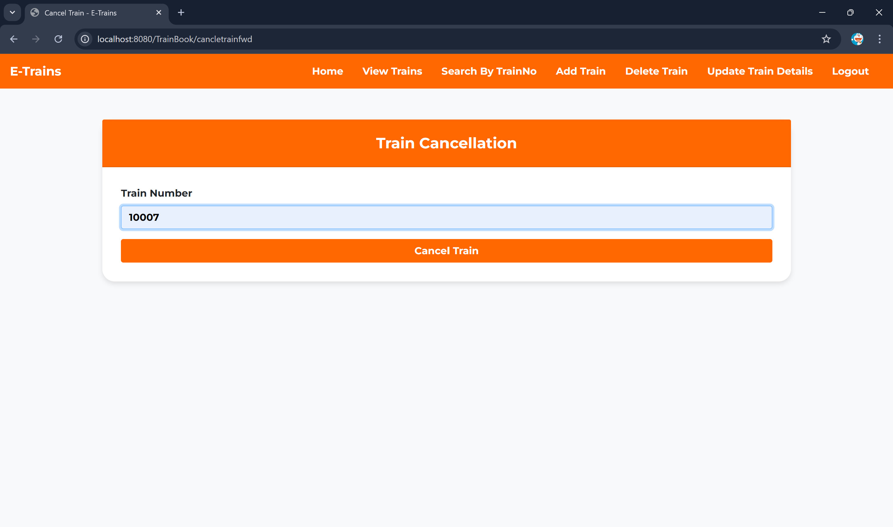
    - Admin interface for managing train cancellations.

13. **Admin Logout**
    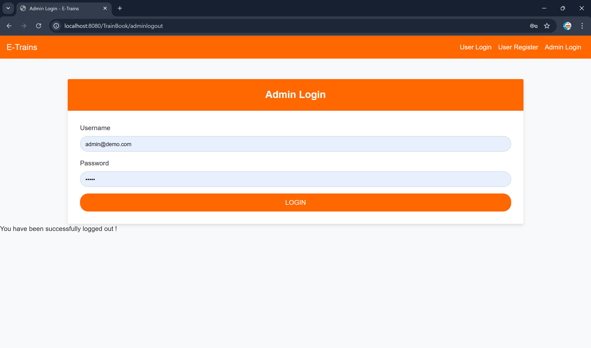
    - Admin logout page to ensure secure exit from the admin panel.

14. **Admin Welcome Screen**
    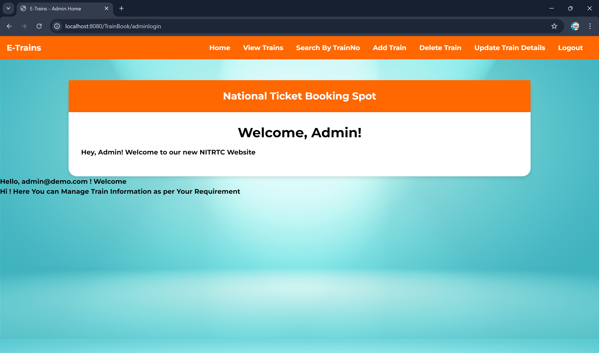
    - Welcome screen for administrators upon logging into the admin panel.

15. **Admin View Train**
    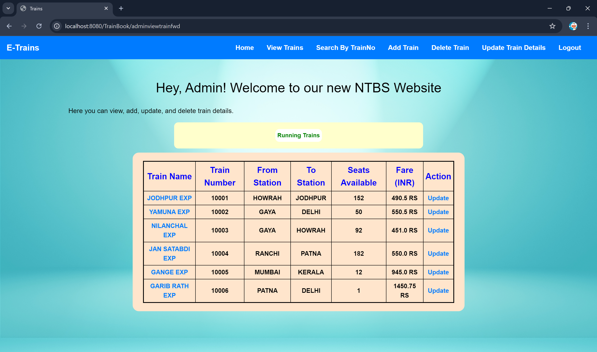
    - Admin view of all trains currently listed in the system.

16. **User Login**
    
    - User login page for accessing personal accounts.

17. **User Search Train**
    
    - Search interface for users to find trains based on their criteria.

18. **User Update Profile**
    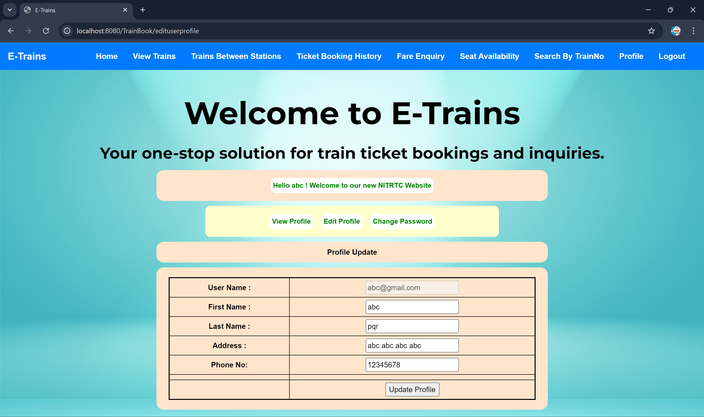
    - Page for users to update their personal information.

19. **User View Trains**
    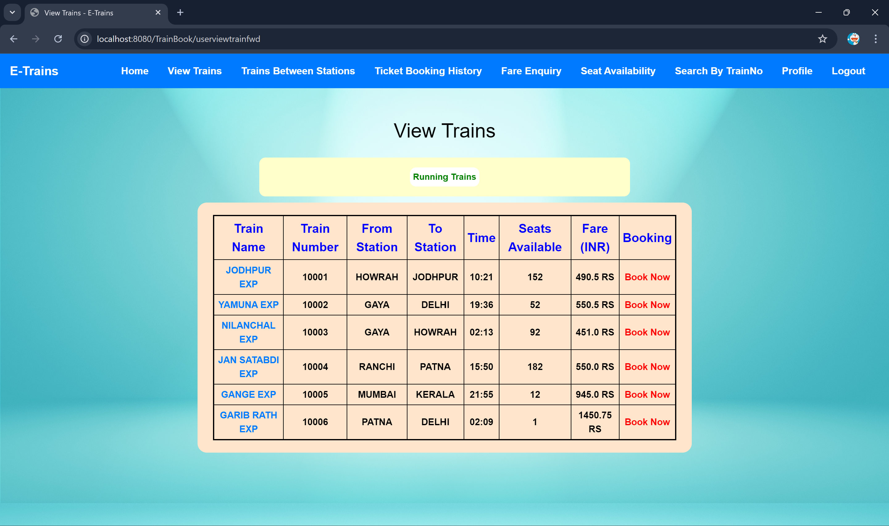
    - Detailed view of train schedules available to users.

20. **User Change Password**
    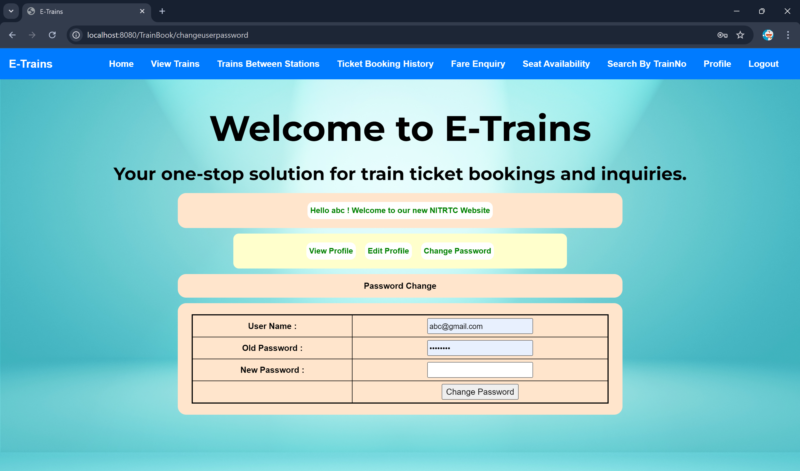
    - Interface for users to securely change their passwords.

---

_For any suggestions, improvements, or feedback, please feel free to reach out._

**Deven Kaushik**  
_Project Leader_
